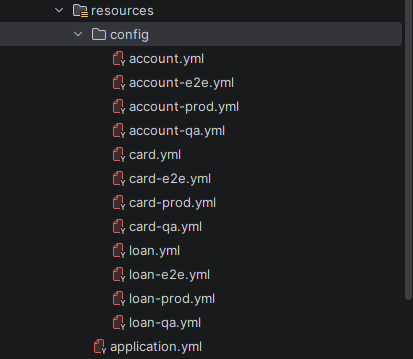
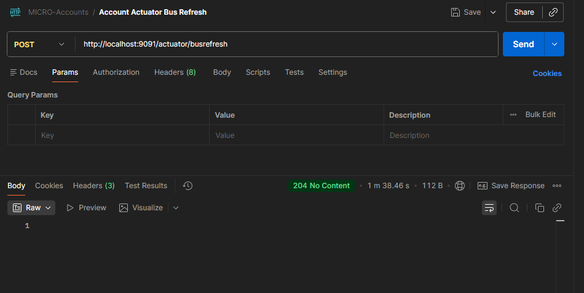
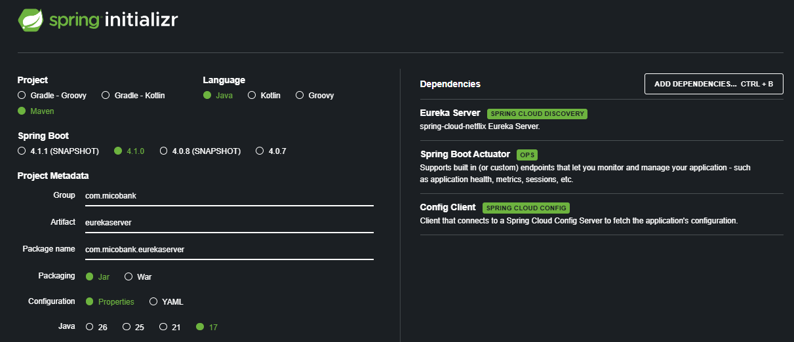

# <span style="color:#2E86DE">Account Microservice</span>

<span style="color:#A29BFE">A Spring Boot microservice for managing account operations in the MicoBank system.</span>

## <span style="color:#00B894">Overview</span>

This is a RESTful API service built with Spring Boot 4.1.0 that handles account-related operations for the MicoBank platform. It provides endpoints for account management and integrates with MySQL for data persistence.

## <span style="color:#00B894">Technology Stack</span>

- <span style="color:#FF7675">**Framework**</span>: Spring Boot 4.1.0
- <span style="color:#FF7675">**Language**</span>: Java 17
- <span style="color:#FF7675">**Build Tool**</span>: Maven
- <span style="color:#FF7675">**Database**</span>: MySQL
- <span style="color:#FF7675">**ORM**</span>: JPA (Hibernate)

## <span style="color:#00B894">Features</span>

- 🔧 Account management REST APIs
- ✅ Data validation using Spring Validation
- 💾 JPA-based database persistence
- 📊 Health monitoring with Spring Actuator
- 🛠️ Development tools with Spring DevTools

## <span style="color:#00B894">Prerequisites</span>

- <span style="color:#FDCB6E">Java 17</span> or higher
- <span style="color:#FDCB6E">Maven 3.6+</span>
- <span style="color:#FDCB6E">MySQL 5.7</span> or higher

## <span style="color:#00B894">Getting Started</span>

### <span style="color:#6C5CE7">1. Clone the Repository</span>
```bash
git clone https://github.com/bhatkiran74/account.git
cd account
```

### <span style="color:#6C5CE7">2. Configure Database</span>
Update `application.yml` with your MySQL configuration:
```yml
spring:
  application:
    name: account-service

  datasource:
    url: jdbc:mysql://localhost:3306/account?createDatabaseIfNotExist=true&useSSL=false&serverTimezone=UTC&allowPublicKeyRetrieval=true
    username: root
    password: root
    driver-class-name: com.mysql.cj.jdbc.Driver

  jpa:
    hibernate:
      ddl-auto: update
    show-sql: true
    properties:
      hibernate:
        format_sql: true
        dialect: org.hibernate.dialect.MySQLDialect
```

### <span style="color:#6C5CE7">3. Build the Project</span>
```bash
./mvnw clean install
```

### <span style="color:#6C5CE7">4. Run the Application</span>
```bash
./mvnw spring-boot:run
```

The application will start on `http://localhost:8080`

## <span style="color:#00B894">API Documentation</span>

The API documentation is available at:
- <span style="color:#E17055">**Actuator**</span>: `http://localhost:8080/actuator`

## <span style="color:#00B894">Project Structure</span>

```
src/
├── main/
│   ├── java/
│   │   └── com/micobank/account/
│   └── resources/
│       └── application.properties
└── test/
    └── java/
```

## <span style="color:#00B894">Dependencies</span>

- <span style="color:#74B9FF">spring-boot-starter-actuator</span>
- <span style="color:#74B9FF">spring-boot-starter-data-jpa</span>
- <span style="color:#74B9FF">spring-boot-starter-validation</span>
- <span style="color:#74B9FF">spring-boot-starter-webmvc</span>
- <span style="color:#74B9FF">spring-boot-devtools</span>
- <span style="color:#74B9FF">mysql-connector-j</span>
- <span style="color:#74B9FF">lombok</span>

## <span style="color:#00B894">Testing</span>

Run tests using Maven:
```bash
./mvnw test
```

---

<span style="color:#2D3436">**Last Updated**: 2026-08-11</span>

## License

This project is part of the MicoBank platform.

## Support

For issues or questions, please contact the development team.


## <span style="color:#431515">Implementation of Validation for Spring Boot</span>
### <span style="color:#F9543B">Step 1: Add Validation Dependencies</span>
```xml
<dependency>
    <groupId>org.springframework.boot</groupId>
    <artifactId>spring-boot-starter-validation</artifactId>
</dependency>
```
### <span style="color:#F9543B">Step 2: Add Validation Annotations To DTO's</span>

```java
@Data
public class CustomerDto {

    @NotBlank(message = "Name is required")
    @Size(min = 2, max = 50, message = "Name must be between 2 and 50 characters")
    private String name;

    @NotBlank(message = "Email is required")
    @Email(message = "Please provide a valid email address")
    private String email;

    @NotBlank(message = "Mobile number is required")
    @Pattern(
            regexp = "^[6-9]\\d{9}$",
            message = "Mobile number must be a valid 10-digit Indian mobile number"
    )
    private String mobileNumber;

    @Valid
    private AccountDto accountDto;
}

```

### <span style="color:#F9543B">Step 3: Add @Validated Annotations To RestController</span>

```java
@RestController
@RequestMapping(path = "/api/v1/account", produces = {MediaType.APPLICATION_JSON_VALUE})
@Validated
public class AccountRestController {

    // Inject account service to handle account-related business logic
    @Autowired
    private IAccountService iAccountService;

    // USE : @Valid annotation to validate the request body for creating a new account
    @PostMapping("/create")
    ResponseEntity<ResponseDto> createAccount(@Valid @RequestBody CustomerDto customerDto) {
        iAccountService.createAccount(customerDto);
        return ResponseEntity.status(HttpStatus.CREATED)
                .body(new ResponseDto(
                        AccountConstants.STATUS_201,
                        AccountConstants.MESSAGE_201));
    }

    // USE : @Pattern annotation to validate the mobile number format in the request parameter
    @GetMapping("/fetch")
    ResponseEntity<CustomerDto> fetchAccountDetailsUsingMobileNo(
            @RequestParam @Pattern(regexp = "^[6-9]\\d{9}$",message = "Please provide a valid 10-digit Indian mobile number")
            String mobileNumber) {
        CustomerDto customerDto = iAccountService.findAccountDetails(mobileNumber);
        return ResponseEntity.status(HttpStatus.OK).body(customerDto);
    }
}
```


### <span style="color:#F9543B">Step 4: OverRide handleMethodArgumentNotValid Exception Handler Method </span>
```java
@ControllerAdvice
public class GlobalExceptionHandler extends ResponseEntityExceptionHandler {

    @Override
    protected @Nullable ResponseEntity<Object> handleMethodArgumentNotValid(
            MethodArgumentNotValidException ex,
            HttpHeaders headers,
            HttpStatusCode status,
            WebRequest request) {

        Map<String, String> validationErrors = new HashMap<>();
        List<ObjectError> allErrors = ex.getBindingResult().getAllErrors();

        allErrors.forEach(error -> {
            String fieldName = ((FieldError) error).getField();
            String validationMsg = error.getDefaultMessage();

            validationErrors.put(fieldName, validationMsg);
        });

        return new ResponseEntity<>(validationErrors, HttpStatus.BAD_REQUEST);
    }
    
}

```


## Implementation of Auditing for Spring Boot</span>
### Step 1: Add Anotation to BaseEntity</span>
```java

@MappedSuperclass
@Getter
@Setter
@ToString
@EntityListeners(AuditingEntityListener.class)
public class BaseEntity {

    @Column(updatable = false)
    @CreatedDate
    private LocalDateTime createdAt;

    @Column(updatable = false)
    @CreatedBy
    private String createdBy;

    @Column(insertable = false)
    @LastModifiedDate
    private LocalDateTime updatedAt;

    @Column(insertable = false)
    @LastModifiedBy
    private String updatedBy;
}

```

### Step 2: Create AuditorAware Bean in Configuration Class
```java

@Component("AuditAwareImpl")
public class AuditAwareImpl implements AuditorAware<String> {

    @Override
    public java.util.Optional<String> getCurrentAuditor() {
        // Return the current auditor (user) as an Optional
        return Optional.of("Account_MS"); // Replace with actual user retrieval logic
    }
}

```


### Step 3: Add @EnableJpaAuditing Annotation to Main Application Class
```java
@SpringBootApplication
@EnableJpaAuditing(auditorAwareRef = "AuditAwareImpl")
public class AccountApplication {

	public static void main(String[] args) {
		SpringApplication.run(AccountApplication.class, args);
	}

}
```


## Implementation of Swagger Docs for Spring Boot</span>
### Step 1: Add Dependency : springdoc-openapi-starter-webmvc-ui
```xml
   <dependency>
      <groupId>org.springdoc</groupId>
      <artifactId>springdoc-openapi-starter-webmvc-ui</artifactId>
      <version>3.1.0</version>
   </dependency>

```

### Step 2: Access Swagger UI

Use the following URL to access the Swagger UI:

```text
http://localhost:8080/swagger-ui.html
```

# Ways To create Docker Image for Spring Boot Application
## 1. Using Dockerfile
### Step 1: add packaging jar configuration
```xml
  	<packaging>jar</packaging>
```

### Step 2: Create Dockerfile
``` dockerfile
  	
FROM arm64v8/openjdk:17-jdk-slim
LABEL authors="kiran"

MAINTAINER bhatkiran74

COPY target/account-0.0.1-SNAPSHOT.jar account-0.0.1-SNAPSHOT.jar

ENTRYPOINT ["java", "-jar", "account-0.0.1-SNAPSHOT.jar"]
```

### Commands
```text
docker build . -t bhatkiran74/account:s1
```
```text
docker run -p 9091:9091 bhatkiran74/account:s1
```


## 2. Using Build Packs
### Step 1: add packaging jar configuration
```xml
  	<packaging>jar</packaging>
```
### Step 2: add configuration to plugin

```xml
<plugin>
    <groupId>org.springframework.boot</groupId>
    <artifactId>spring-boot-maven-plugin</artifactId>
    <configuration>
        <image>
            <name>bhatkiran74/${project.artifactId}:s1</name>
        </image>
    </configuration>
</plugin>
```


### Step 3: Run the following command to build the Docker image using Spring Boot's buildpacks:
```text
 mvn spring-boot:build-image
```

## 3. Using Google Jib Plugin
### Step 1: add packaging jar configuration
```xml
  	<packaging>jar</packaging>
```


### Step 2: add configuration to plugin

```xml
<plugin>
    <groupId>com.google.cloud.tools</groupId>
    <artifactId>jib-maven-plugin</artifactId>
    <version>0.9.0</version>
    <configuration>
        <to>
            <image>bhatkiran74/${project.artifactId}:s1</image>
        </to>
    </configuration>
</plugin>
```

### Step 3: Run the following command to build the Docker image
```text
 mvn compile jib:dockerBuild
```


## How To Read Configuration Properties in Spring Boot
### 1: Using @Value Annotation
```java
@Component
public class MyComponent {  

    @Value("${my.property}")
    private String myProperty;

    public void printProperty() {
        System.out.println("Property value: " + myProperty);
    }
}
```

### 2: Using Environment Object

```java
@Autowired
private Environment env;

public void printProperty() {
    String myProperty = env.getProperty("my.property");
    System.out.println("Property value: " + myProperty);
}
```


### 3: Using @ConfigurationProperties Annotation

```java

import org.springframework.boot.context.properties.ConfigurationProperties;

@ConfigurationProperties(prefix = "my")
public class MyProperties {
    private String property;
    // Getters and Setters
}


//add @ConfigurationPropertiesScan to main spring boot application class
@SpringBootApplication
@EnableJpaAuditing(auditorAwareRef = "AuditAwareImpl")
@ConfigurationPropertiesScan
public class AccountApplication {

    public static void main(String[] args) {
        SpringApplication.run(AccountApplication.class, args);
    }

}

```


## How To Use Spring Profiles in Spring Boot
### 1: Create application-{profile}.properties or application-{profile}.yml files
```text
application-e2e.yml
application-qa.yml
application-prod.yml
```

### 2: Add config to application.properties or application.yml
```yml
spring:
  profiles:
    active: e2e

```

### 3: Add config to application-{profile}.properties or application-{profile}.yml file
```yml
#Profile - application-e2e.yml
spring:
  config:
    active:
      on-profile: "e2e"


#Profile - application-qa.yml
spring:
  config:
    active:
      on-profile: "qa"


#Profile - application-prod.yml
spring:
  config:
    active:
      on-profile: "prod"

```


## How To Use Config Server in Spring Boot
### 1: create Spring boot project for Config-server with dependencies
```xml
<!--Config Server Dependencies-->
<dependency>
    <groupId>org.springframework.boot</groupId>
    <artifactId>spring-boot-starter-actuator</artifactId>
</dependency>
        <!--Spring Actuator-->
<dependency>
    <groupId>org.springframework.cloud</groupId>
    <artifactId>spring-cloud-config-server</artifactId>
</dependency>
```

### 2: Add @EnableConfigServer annotation to main spring boot application class
```java
@SpringBootApplication
@EnableConfigServer
public class ConfigServerApplication {
    public static void main(String[] args) {
        SpringApplication.run(ConfigServerApplication.class, args);
    }
}
```

### 3: create yml file structure for config-server


### 4: Add dependency for config-client in microservice project
```xml

<spring-cloud.version>2025.1.2</spring-cloud.version>


<dependency>
      <groupId>org.springframework.cloud</groupId>
      <artifactId>spring-cloud-starter-config</artifactId>
</dependency>


<dependencyManagement>
<dependencies>
    <dependency>
        <groupId>org.springframework.cloud</groupId>
        <artifactId>spring-cloud-dependencies</artifactId>
        <version>${spring-cloud.version}</version>
        <type>pom</type>
        <scope>import</scope>
    </dependency>
</dependencies>
</dependencyManagement>
```
### 4: Delete all environment related yml from Microservice project and add below config to connect config server
```yml
spring:
  application:
    name: "account"
  profiles:
    active: prod
  config:
    import: "optional:configserver:http://localhost:9071"
```
### 5: Test via Microservice project Program arguments
```text
--spring.profiles.active=qa
```

## Using file system
```yml
spring:
  cloud:
    config:
      server:
        native:
          search-locations: "file:///I://Switch 26//config"
```

## Using Github Repo
```yml
spring:
  application:
    name: configserver
  profiles:
    active: git
  cloud:
    config:
      server:
        git:
          uri: "https://github.com/bhatkiran74/mico-config.git"
          default-label: main
          timeout: 5
          clone-on-start: true
          force-pull: true
```


## Enabling of Actuator endpoints
### Access Using below URL : 
```http request
http://localhost:9091/actuator
```

```yml
management:
  endpoints:
    web:
      exposure:
        include: "*"
```
### Actuator Dependency
```xml
<dependency>
    <groupId>org.springframework.boot</groupId>
    <artifactId>spring-boot-starter-actuator</artifactId>
</dependency>
```


## If we want refreash all Microservice then we need to use RabitMQ
### Steps to use RabitMQ
### 1. Install RabitMQ or Use Docker image
```text
docker run -it --rm --name rabbitmq -p 5672:5672 -p 15672:15672 rabbitmq:4-management
```

```xml
<dependency>
    <groupId>org.springframework.cloud</groupId>
    <artifactId>spring-cloud-starter-bus-amqp</artifactId>
</dependency>
```
```yml
spring:
  rabbitmq:
  host: "localhost"
  port: 5672
  username: "guest"
  password: "guest"

```
#### Direct Refresh all Microservices then they will fetch all config
```text
http://localhost:9091/actuator/busrefresh
```



## Eureka Server Setup
### Step 1: Create Eureka Server using below dependency 
```xml
<dependency>
    <groupId>org.springframework.cloud</groupId>
    <artifactId>spring-cloud-starter-netflix-eureka-server</artifactId>
</dependency>

```



### Step 2: Add configuration for yml & anonation to main class
```text
@EnableEurekaServer
@SpringBootApplication
public class EurekaServerApplication{
    //todo
}
```
```yml
spring:
  application:
    name: "eurekaserver"
  config:
    import: "optional:configserver:http://localhost:9071"


management:
  endpoints:
    web:
      exposure:
        include: "*"
  health:
    livenessstate:
      enabled: true
    readinessstate:
      enabled: true

  endpoint:
    health:
      show-details: always
      probes:
        enabled: true


#Config repo configuration
server:
  port: 8070

eureka:
  instance:
    hostname: localhost

  client:
    register-with-eureka: false
    fetch-registry: false
    service-url:
      defaultZone: http://${eureka.instance.hostname}:${server.port}/eureka/

  server:
    enable-self-preservation: true
```

## Eureka Client setup
###  Step 1: Add dependency
```xml
<dependency>
    <groupId>org.springframework.cloud</groupId>
    <artifactId>spring-cloud-starter-netflix-eureka-client</artifactId>
</dependency>
```
###  Step 2: Yml Config
```yml
management:
  endpoints:
    web:
      exposure:
        include: "*"
  enpoint:
    shutdown:
      access: unrestricted

  info:
    env:
      enabled: true

eureka:
  client:
    register-with-eureka: true
    fetch-registry: true
    service-url:
      defaultZone: http://localhost:8070/eureka/

  instance:
    prefer-ip-address: true


info:
  app:
    name: "Account"
    description: "Mico Bank account application"
    version: "1.0.0"
```